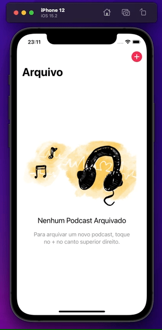
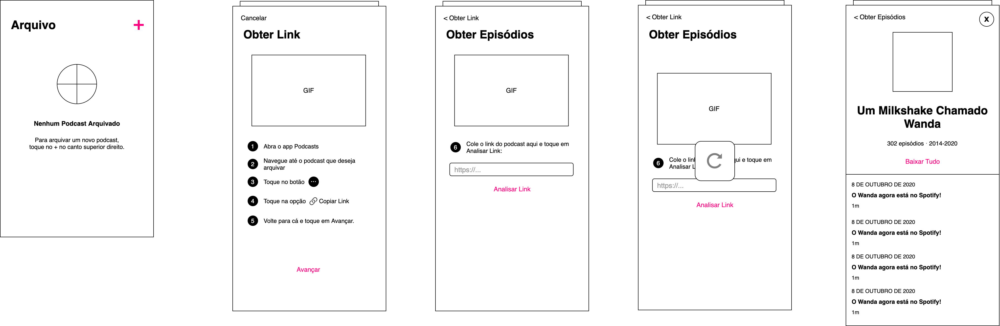

# The Library Is Open! 💃🏼

Arquive os episódios do seu podcast favorito com este app para iOS.

## Funcionalidades

- [x] Obter URL do feed de um podcast a partir do link do Apple Podcasts
- [x] Obter lista de episódios
- [x] Baixar episódios
- [ ] Armazenar episódios baixados em um arquivo .zip (em breve)
- [ ] Upar o arquivo para um serviço de armazenamento na nuvem (em breve)

## Requisitos

- iOS 14.2+
- Xcode 12.2+

## Como rodar

1. Clone o repositório e abra TheLibraryIsOpen.xcodeproj com o Xcode.
1. Aguarde o download das dependências pelo Xcode.
1. ⌘ + B para buildar. ⌘ + R para rodar no simulador.

## Sobre esse repo

Rafael Claycon Schmitt – [@mitt_rafael](https://twitter.com/mitt_rafael) – rafael.claycon@gmail.com

Distribuído sob a licença MIT. Veja ``LICENSE`` para mais informações.
