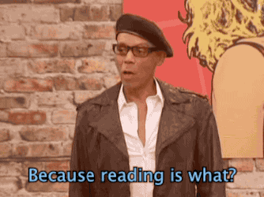

# The Library Is Open! 💃🏼

This is meant as a celebration of how open podcasts (used to) be.

Download your favorites before the big bad takes them (I'm talking about at you, Spotify).

## Features

### Main features (MVP)

- [x] Get podcast feed URL from an Apple Podcasts link
- [x] Get episode list
- [x] Download episodes
- [ ] Store downloaded episodes in a ZIP file
- [ ] Upload the file do iCloud Drive (and later expand to more cloud providers, e. g., Google Drive)

### Backlog

Take a look at the project's backlog on Trello: https://trello.com/b/RvZ82ZLx

### Supported languages

- 🇺🇸 English
- 🇧🇷 Brazilian Portuguese

To change between languages, change the Simulator language in Settings or the app language under `Target > Edit Scheme... > Run > Options > App Language`.

## Prerequisites

- iOS 15.0+
- Xcode 13+

## How to run

1. Clone the repo and open TheLibraryIsOpen.xcodeproj on Xcode.
1. Wait for Xcode to download all dependencies (Swift packages).
1. Use ⌘ + B to build and ⌘ + R to run the app on the Simulator.

## About this repo

Rafael Claycon Schmitt – [@mitt_rafael](https://twitter.com/mitt_rafael) – rafael.claycon@gmail.com

Distributed under the MIT license. See ``LICENSE`` for more information.
